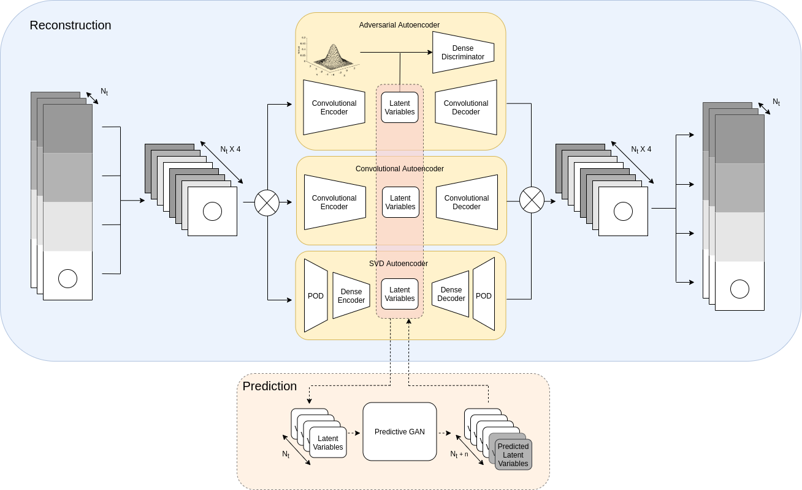

# DD-GAN-AE

## Autoencoders for the DD-GAN

[](https://codecov.io/gh/acse-zrw20/DD-GAN-AE)
[](https://github.com/acse-zrw20/DD-GAN-AE/blob/main/LICENSE)
[](https://github.com/acse-zrw220/DD-GAN-AE/blob/main/docs/docs.pdf)


<!-- PROJECT LOGO -->

<br />
<p align="center">
  <a href="https://github.com/acse-zrw20/DD-GAN-AE">
    
  </a>

<p align="center">
    <br />
    <a href="https://github.com/acse-zrw20/DD-GAN-AE/blob/main/docs/docs.pdf"><strong>Explore the docs»</strong></a>
    <br />
    <br />
    <a href="https://github.com/acse-zrw20/DD-GAN-AE/issues">Report Bug</a>
  </p>
</p>

<!-- TABLE OF CONTENTS -->

<details open="open">
  <summary>Table of Contents</summary>
  <ol>
    <li>
      <a href="#about-the-project">About The Project</a>
    </li>
    <li>
      <a href="#getting-started">Getting Started</a>
      <ul>
        <li><a href="#prerequisites">Prerequisites</a></li>
        <li><a href="#installation">Installation</a></li>
      </ul>
    </li>
    <li><a href="#usage">Usage</a></li>
    <li><a href="#license">License</a></li>
    <li><a href="#contact">Contact</a></li>
    <li><a href="#acknowledgements">Acknowledgements</a></li>
  </ol>
</details>

<!-- ABOUT THE PROJECT -->

## About The Project

This project contains an intuitive library for interacting with compressive and predictive methods for predicting fluid dynamics simulations efficiently. Code was built for a Msc thesis at the Imperial College London.

Read the [documentation](https://github.com/acse-zrw20/DD-GAN-AE/blob/main/docs/docs.pdf) for further info!

<!-- GETTING STARTED -->

## Prerequisites

* Python 3.8
* Tensorflow and other packages in ```requirements.txt```
* (Optional) GPU with CUDA

## Installation

Follow these steps to install:

1. ```git clone https://github.com/acse-zrw20/DD-GAN-AE```
2. ```cd ./DD-GAN-AE```
3. ```pip install -e .```

<!-- USAGE EXAMPLES -->

## Getting Started

In a python file, import the following to use all of the functionality:

```python
import ddganAE
```
Training a model for reconstruction:

```python
from ddganAE.models import CAE
from ddganAE.architectures.cae.D2 import *
import tf

input_shape = (55, 42, 2)
dataset = np.load(...) # dataset with shape (nsamples, 55, 42, 2)

optimizer = tf.keras.optimizers.Adam() # Define an optimizer
initializer = tf.keras.initializers.RandomNormal() # Define a weights initializer

# Define any encoder and decoder, see docs for more premade architectures
encoder, decoder = build_omata_encoder_decoder(input_shape, 10, initializer)

cae = CAE(encoder, decoder, optimizer) # define the model
cae.compile(input_shape) # compile the model

cae.train(dataset, 200) # train the model with 200 epochs

recon_dataset = cae.predict(dataset) # pass the dataset through the model and generate outputs
```

## Examples

* A notebook with compression usage examples on flow past cylinder dataset: [](https://colab.research.google.com/drive/1oxLf-SayXWrG_grniEptbmIwhMo4XMCD#offline=true&sandboxMode=true)
* A notebook with compression usage examples on slug flow dataset: [](https://colab.research.google.com/drive/1hsRsPp64dbQz0f3zG7nwcENvSKoCScoM#offline=true&sandboxMode=true)

<!-- ACKNOWLEDGEMENTS 
_For more information, please refer to the report in this repo_
-->
<!-- LICENSE -->

## License

Distributed under the MIT License. See `LICENSE` for more information.

<!-- CONTACT -->


## Contact

* Wolffs, Zef zefwolffs@gmail.com

<!-- ACKNOWLEDGEMENTS -->

## Acknowledgements

* Dr. Claire Heaney
* Prof. Christopher Pain
* Royal School of Mines, Imperial College London

<!-- MARKDOWN LINKS & IMAGES -->

<!-- https://www.markdownguide.org/basic-syntax/#reference-style-links 
[contributors-shield]: https://img.shields.io/github/contributors/acse-zrw20/group-project-the-uploaders.svg?style=for-the-badge
[contributors-url]: https://github.com/acse-zrw20/DD-GAN-AE/graphs/contributors
[issues-shield]: https://img.shields.io/github/issues/acse-2020/group-project-the-uploaders.svg?style=for-the-badge
[issues-url]: https://github.com/acse-2020/acse-4-x-ray-classification-losslandscape/issues
[license-shield]: https://img.shields.io/github/license/acse-2020/group-project-the-uploaders.svg?style=for-the-badge
[license-url]: https://github.com/acse-2020/acse-4-x-ray-classification-losslandscape/blob/main/LICENSE.txt
-->
